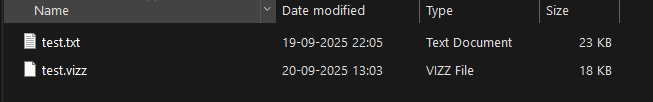

# vizzip

Compress files using Huffman encoding into `.vizz` format.

## Usage

**Compress:**
```bash
npx vizzip input.txt
```

**Decompress:**
```bash
npx vizzip -d file.vizz
```

## Test



## Features

- Huffman encoding compression
- Custom `.vizz` format
- CLI interface
- Lossless compression

## License

MIT © [Visalan-H](https://github.com/Visalan-H)